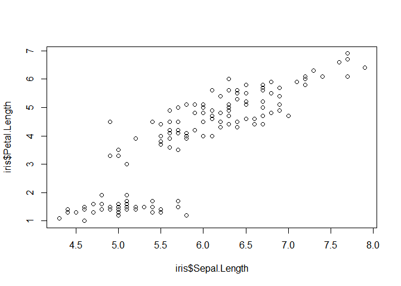

# Step 0 : 분석 환경 설정


```
## [1] "C:/Project/GreenBand_Lpoint5/Source"
```


```r
library(tidyverse) # Preprocessing, Visualizing

library(knitr) # Tidy document

library(ggrepel) # ggplot tidy text
```

# Step 1 : data pre-processing


# Step 2 : EDA


# Step 3 : Modeling

# Step 4 : Insight

# Step 5 : Proposal for New Service


```r
plot(iris$Sepal.Length,iris$Petal.Length)
```




```r
kable(head(iris), caption = 'Table1', align = 'c')
```


Table: Table1

 Sepal.Length    Sepal.Width    Petal.Length    Petal.Width    Species 
--------------  -------------  --------------  -------------  ---------
     5.1             3.5            1.4             0.2        setosa  
     4.9             3.0            1.4             0.2        setosa  
     4.7             3.2            1.3             0.2        setosa  
     4.6             3.1            1.5             0.2        setosa  
     5.0             3.6            1.4             0.2        setosa  
     5.4             3.9            1.7             0.4        setosa  


*기울임*  
\*기울임*    
**굵게**  
**`형광펜`**  
~~지우기~~--이렇게 수정 

##### 1. list
  1. a;lskdfj
  + asdl;fk
      i) asfasf
      i) efsgsdg
        
##### box
    safasdfas  

## Quarterly Results {.tabset .tabset-fade .tabset-pills}

### By Product

(tab content)

### By Region

(tab content)

## Link
<http://rmarkdown.rstudio.com>

[name](http://rmarkdown.rstudio.com)
