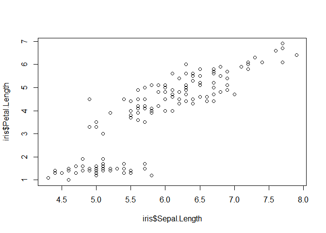

# Step 0 : 분석 환경 설정


```
## [1] "C:/Project/GreenBand_Lpoint5/Source"
```


```r
library(tidyverse) # Preprocessing, Visualizing

library(knitr) # Tidy document

library(ggrepel) # ggplot tidy text
```

# Step 1 : data pre-processing


# Step 2 : EDA


```r
summary(Product_original)
```

```
##     CLNT_ID           SESS_ID            HITS_SEQ           PD_C       
##  Min.   :     25   Min.   :      26   Min.   :  1.00   Min.   :     4  
##  1st Qu.:1656017   1st Qu.: 3242700   1st Qu.: 24.00   1st Qu.:278909  
##  Median :3337207   Median : 6019554   Median : 49.00   Median :513734  
##  Mean   :3323788   Mean   : 5828583   Mean   : 79.52   Mean   :488052  
##  3rd Qu.:4994410   3rd Qu.: 8428752   3rd Qu.:102.00   3rd Qu.:718836  
##  Max.   :6592554   Max.   :10977899   Max.   :500.00   Max.   :847652  
##   PD_ADD_NM          PD_BRA_NM          PD_BUY_AM        
##  Length:1048575     Length:1048575     Length:1048575    
##  Class :character   Class :character   Class :character  
##  Mode  :character   Mode  :character   Mode  :character  
##                                                          
##                                                          
##                                                          
##   PD_BUY_CT        
##  Length:1048575    
##  Class :character  
##  Mode  :character  
##                    
##                    
## 
```

```r
kable(head(Product_original), caption = 'Table1', align = 'c')
```


Table: Table1

 CLNT_ID    SESS_ID     HITS_SEQ     PD_C                   PD_ADD_NM                     PD_BRA_NM      PD_BUY_AM    PD_BUY_CT 
---------  ----------  ----------  --------  ----------------------------------------  ---------------  -----------  -----------
 4139680    7605037        12       642112                색상:워터멜론                 [바비브라운]      39,000          1     
 4140076    10189797       13       570603    색상:BLK0_(BLK0)BLACK|사이즈:120 / 2개       데상트         39,000          2     
 4142395    6158159        85       179538                  (not set)                     [아베다]        39,000          1     
 4144914    7935714        12       554336    색상:블랙|사이즈:160cm(12~13세) / 1개     아디다스 키즈     39,000          1     
 4144917    6406509        78       190306                     5개                        데코르테        39,000          5     
 4147643    4050743        66       149995         사이즈:옵션04.AN868_04 / 1개         앵글로매니아      39,000          1     

+ PD_ADD_NM에 중복되는 내용이 존재  
+ HITS_SEQ 가 1부터 시작한다고 했는데 1부터 시작하는게 확인 불가 


# Step 3 : Modeling

# Step 4 : Insight

# Step 5 : Proposal for New Service


```r
plot(iris$Sepal.Length,iris$Petal.Length)
```




```r
kable(head(iris), caption = 'Table1', align = 'c')
```


Table: Table1

 Sepal.Length    Sepal.Width    Petal.Length    Petal.Width    Species 
--------------  -------------  --------------  -------------  ---------
     5.1             3.5            1.4             0.2        setosa  
     4.9             3.0            1.4             0.2        setosa  
     4.7             3.2            1.3             0.2        setosa  
     4.6             3.1            1.5             0.2        setosa  
     5.0             3.6            1.4             0.2        setosa  
     5.4             3.9            1.7             0.4        setosa  


*기울임*  
\*기울임*    
**굵게**  
**`형광펜`**  
~~지우기~~--이렇게 수정 

##### 1. list
  1. a;lskdfj
  + asdl;fk
      i) asfasf
      i) efsgsdg
        
##### box
    safasdfas  

## Quarterly Results {.tabset .tabset-fade .tabset-pills}

### By Product

(tab content)

### By Region

(tab content)

## Link
<http://rmarkdown.rstudio.com>

[name](http://rmarkdown.rstudio.com)
